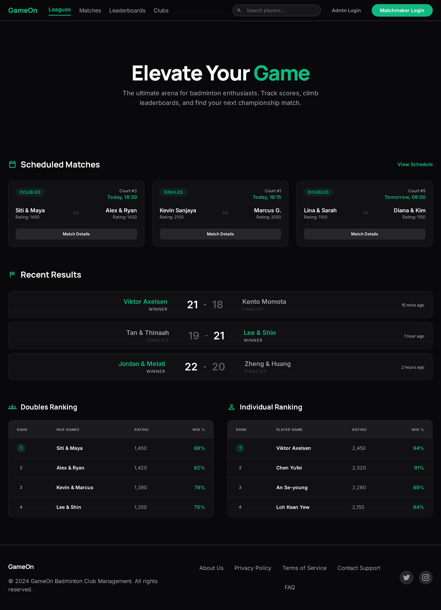
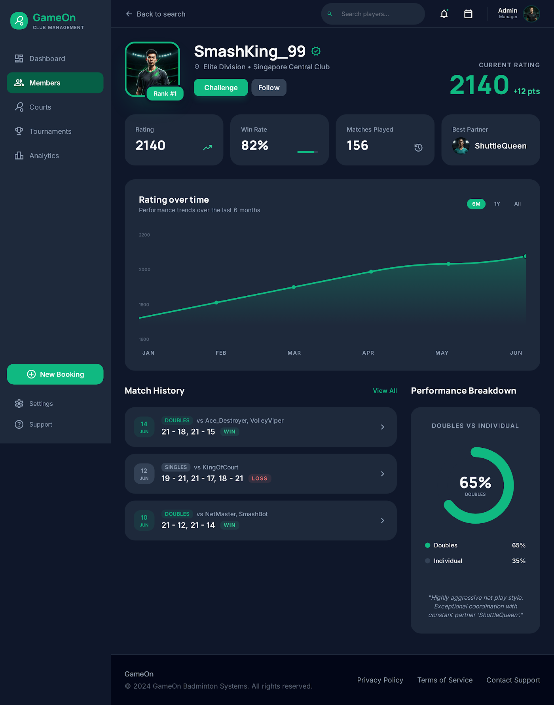
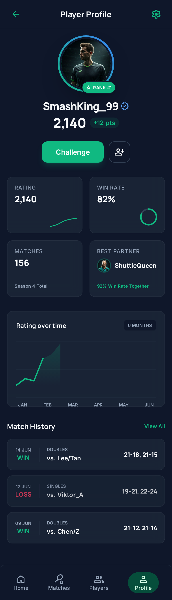
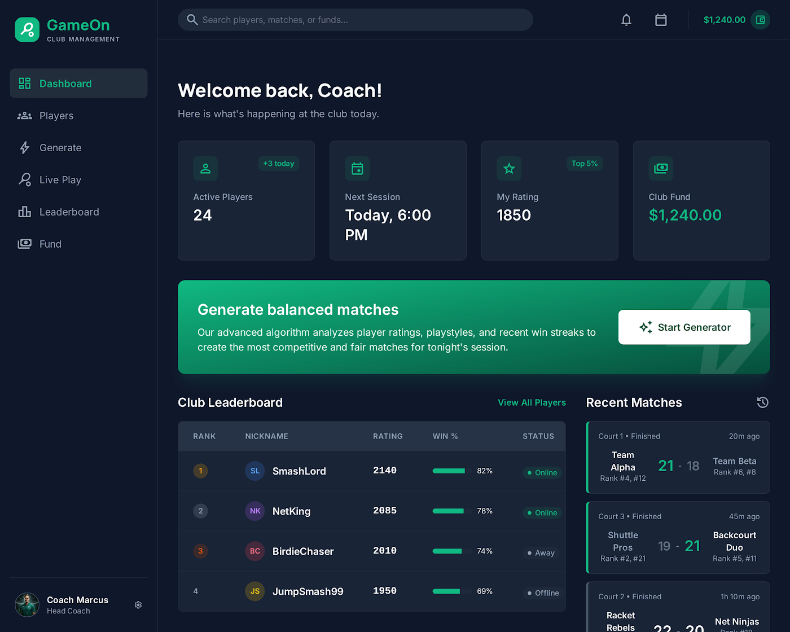
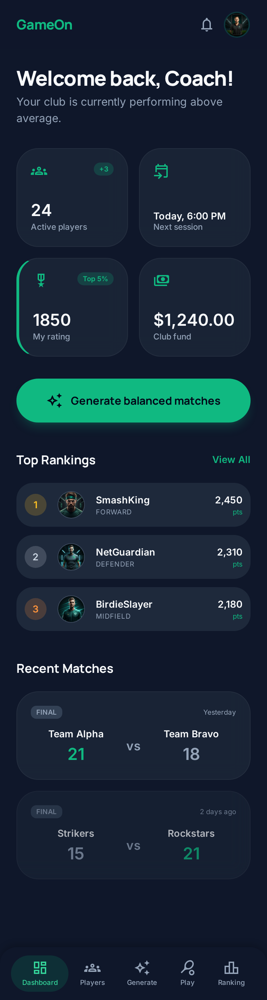

# GameOn — design system: **Emerald Pro** (locked)

Locked design direction for GameOn. Dark, premium "pro stats" look: deep graphite
surfaces, an emerald accent, high-contrast numerics for ratings/scores. See the
decision + tokens in [`docs/adr/0001-design-system-emerald-pro.md`](../adr/0001-design-system-emerald-pro.md).

## Reference renders (`screens/`)
| Screen | Web | Mobile |
|---|---|---|
| Public home |  |  |
| Player profile |  |  |
| Admin dashboard |  |  |

> These are Stitch renders kept as the visual reference (Stitch URLs expire).
> Exact token values are sampled from these when building `packages/ui` (TASK-1.5).
