# GameOn — design exploration (10 directions)

Ten minimalist directions for the GameOn badminton app, each generated in Stitch at
**desktop + mobile**. All are 2–4 tone, clean, with a distinct hue family + font.
Pick one (or two to combine) to become the GameOn design system.

> Stitch project: "GameOn — Design Exploration". These PNGs are the durable copy
> (Stitch image URLs expire).

| # | Theme | Tones | Font | Vibe |
|---|-------|-------|------|------|
| 01 | Indigo Night (dark) | near-black · indigo · white | Sora | evening play, premium, calm |
| 02 | Forest & Lime | white · forest green · lime | Space Grotesk | active / healthy |
| 03 | Coral Warm | cream · coral · ink | DM Sans | social, friendly |
| 04 | Mono Editorial | white · greyscale · cobalt | Inter | data-forward, timeless |
| 05 | Classic Sky | white · navy · sky blue | Plus Jakarta Sans | trustworthy classic |
| 06 | Sunset Duo | off-white · amber · plum | Outfit | lively, tournament |
| 07 | Emerald Pro (dark) | graphite · emerald · white | Manrope | pro stats dashboard |
| 08 | Crimson Match | stone · red · ink | Geist | competitive |
| 09 | Mustard Mono (dark) | near-black · gold · white | Bebas Neue | bold, broadcast |
| 10 | Mint Calm | paper · teal-mint · ink | Epilogue | gentle, welcoming |

Recommendation: **🥇 01 Indigo Night** (best fit for evening courtside use + data legibility),
runners-up **07 Emerald Pro** (dark/greener) and **04 Mono Editorial** (light/minimal).

---

## 01 · Indigo Night  *(dark · indigo · Sora)*
Evening-play friendly dark UI; one indigo accent; strong contrast for ratings/fund.
| Web | Mobile |
|---|---|
| 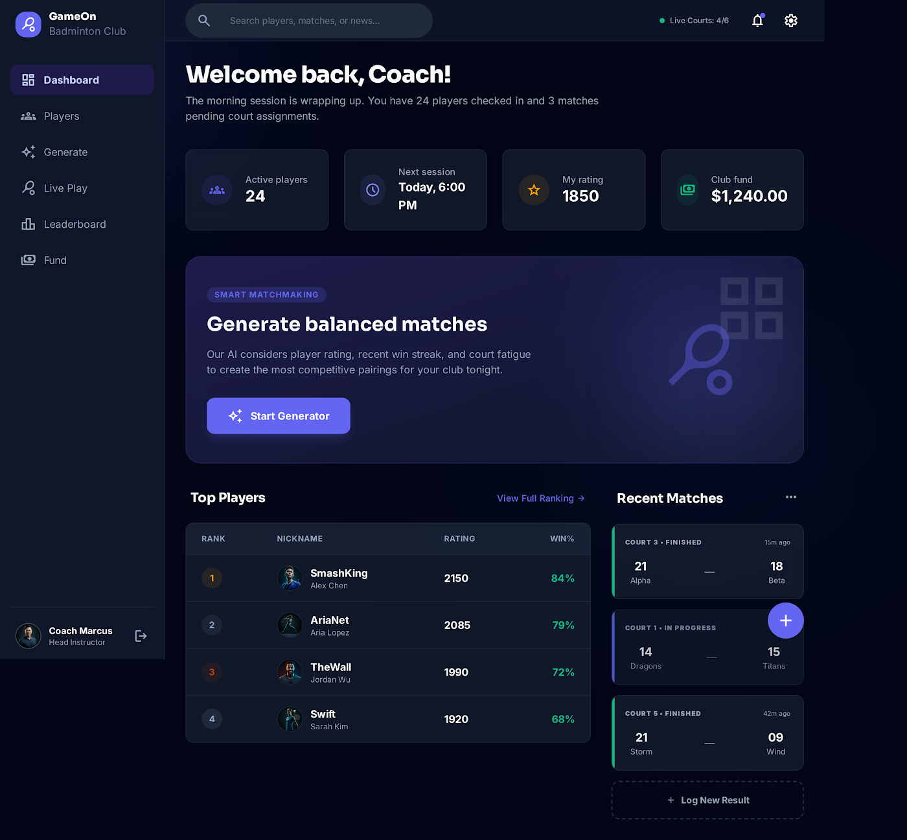 | 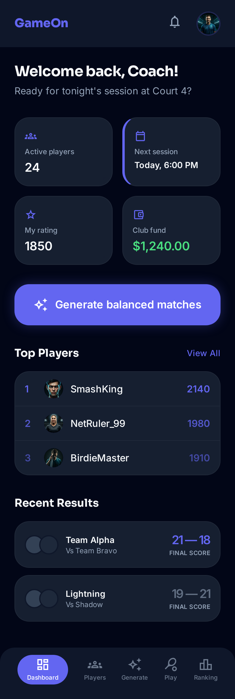 |

## 02 · Forest & Lime  *(light · green + lime · Space Grotesk)*
Movement/health energy; lime reserved for the primary CTA.
| Web | Mobile |
|---|---|
|  |  |

## 03 · Coral Warm  *(light · coral on cream · DM Sans)*
Warm, social, welcoming — not another blue sports app.
| Web | Mobile |
|---|---|
| 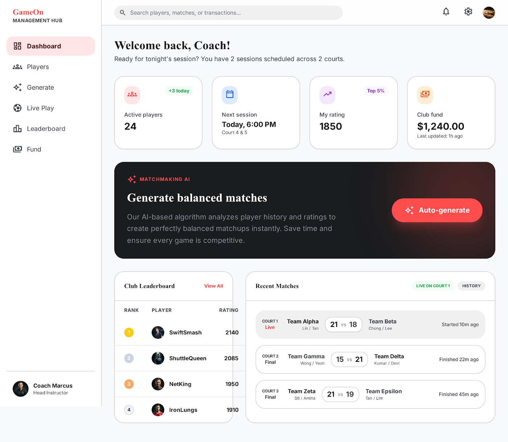 | 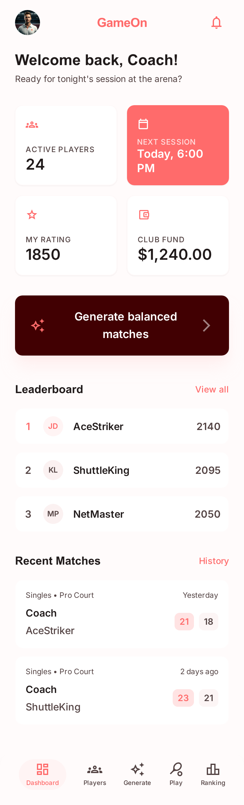 |

## 04 · Mono Editorial  *(light · greyscale + cobalt · Inter)*
Most minimal; data reads cleanest in restrained mono. Timeless.
| Web | Mobile |
|---|---|
| 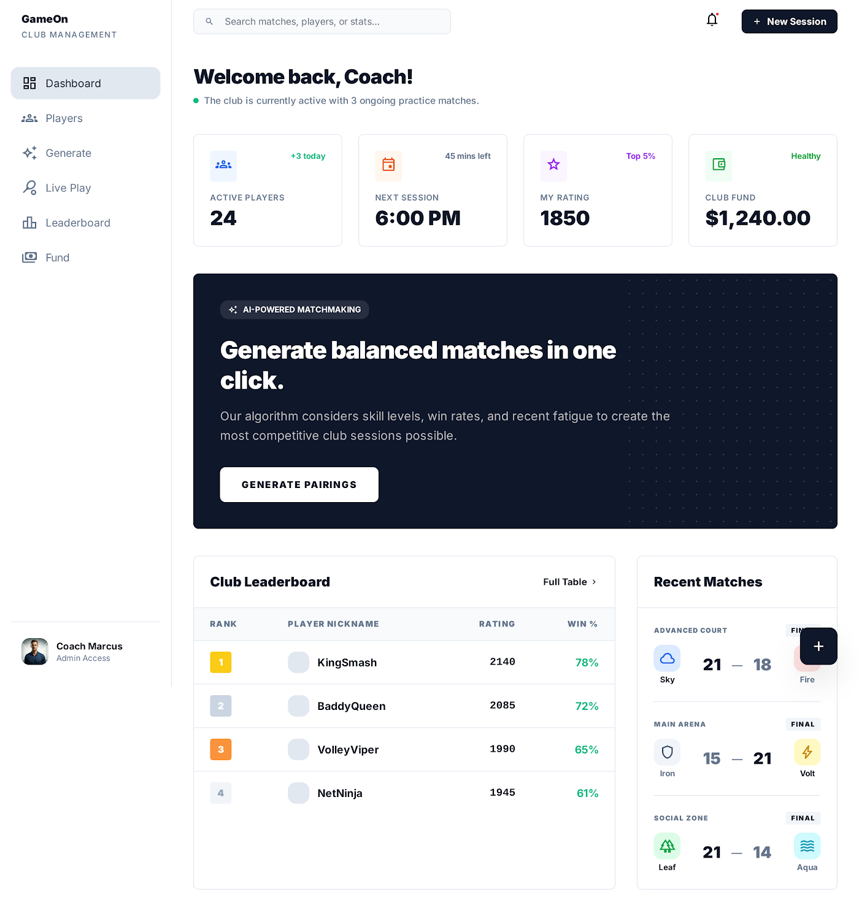 | 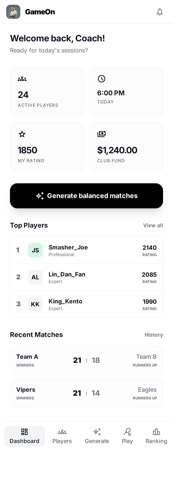 |

## 05 · Classic Sky  *(light · navy + sky · Plus Jakarta Sans)*
Safe, trustworthy, very legible blue.
| Web | Mobile |
|---|---|
| 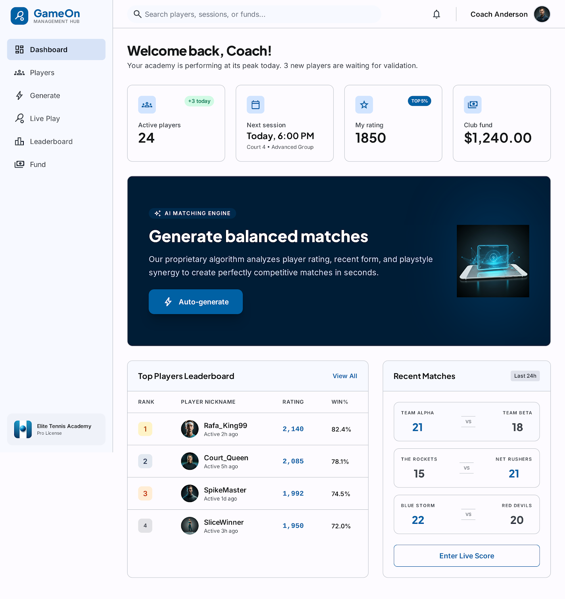 | 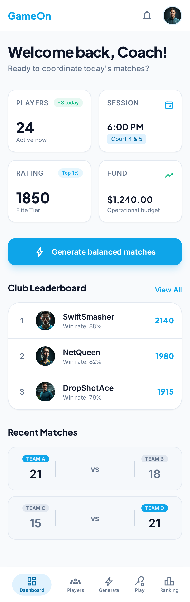 |

## 06 · Sunset Duo  *(light · amber + plum · Outfit)*
Dual accent: amber = action, plum = info. Lively.
| Web | Mobile |
|---|---|
| 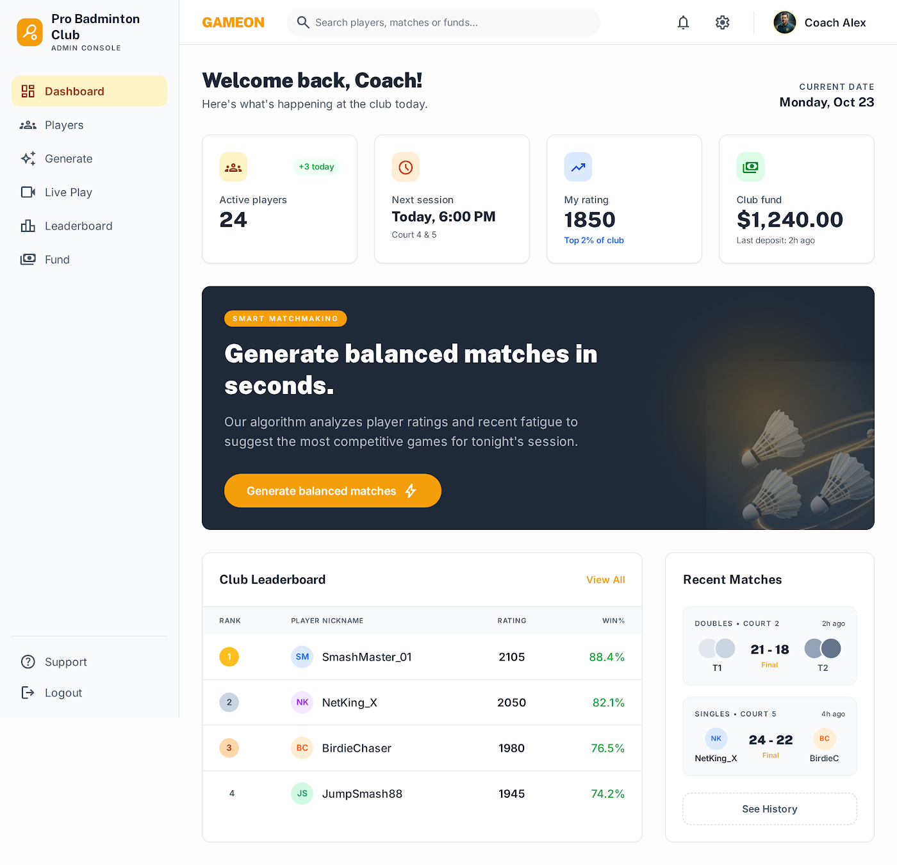 | 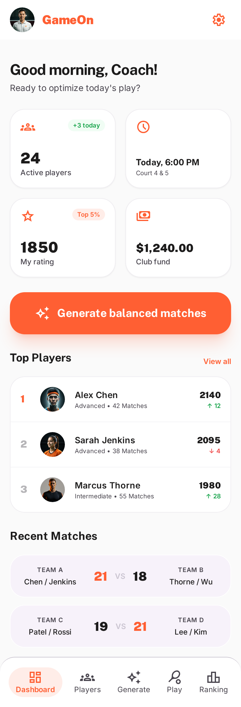 |

## 07 · Emerald Pro  *(dark · emerald on graphite · Manrope)*
Fintech-grade clarity; numbers pop. Premium dark.
| Web | Mobile |
|---|---|
|  |  |

## 08 · Crimson Match  *(light · red on stone · Geist)*
Competitive intensity; clean on warm stone neutrals.
| Web | Mobile |
|---|---|
| 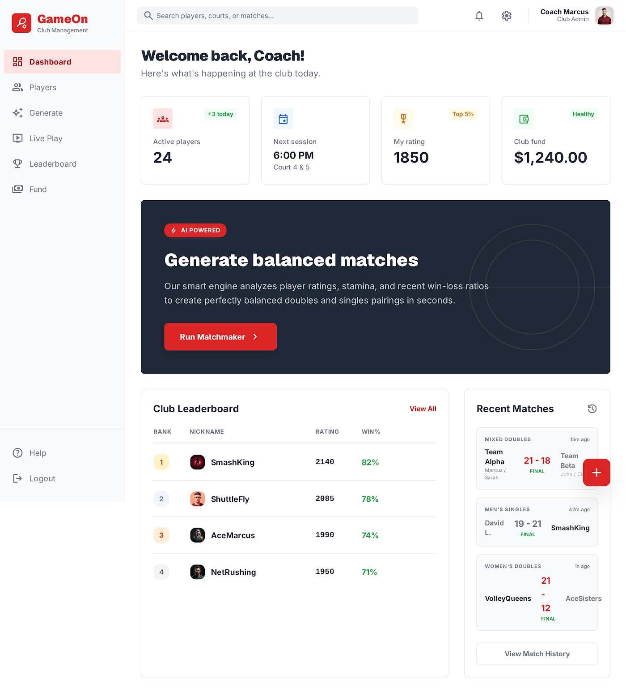 | 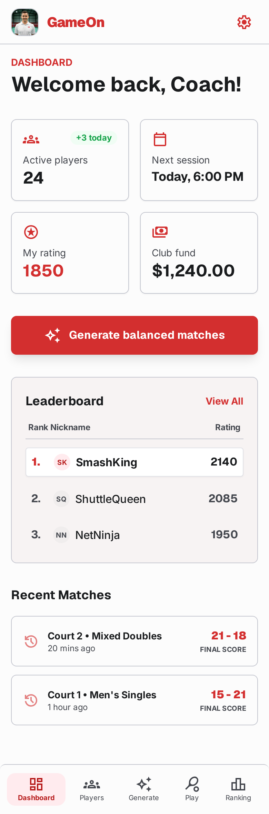 |

## 09 · Mustard Mono  *(dark · gold on near-black · Bebas Neue)*
Boldest; broadcast-graphic personality.
| Web | Mobile |
|---|---|
|  |  |

## 10 · Mint Calm  *(light · soft teal-mint on paper · Epilogue)*
Gentle, airy, welcoming; easy on the eyes for quick check-ins.
| Web | Mobile |
|---|---|
| 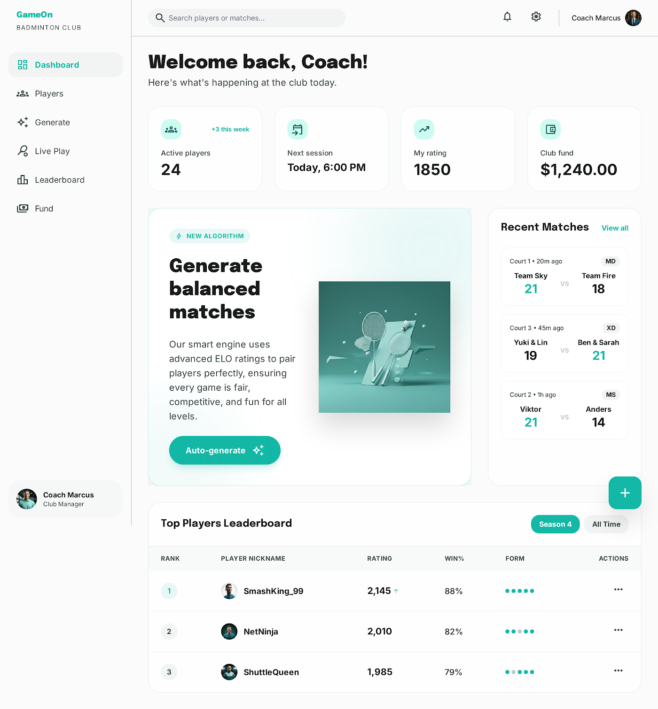 | 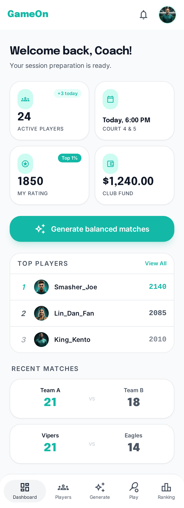 |
