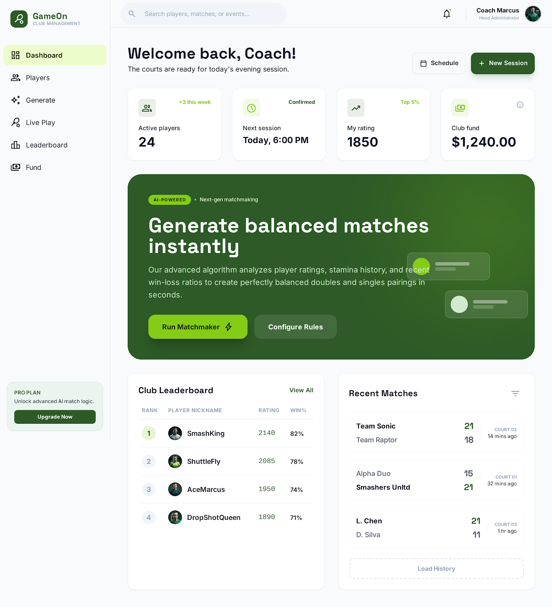
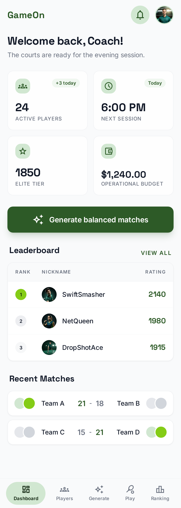
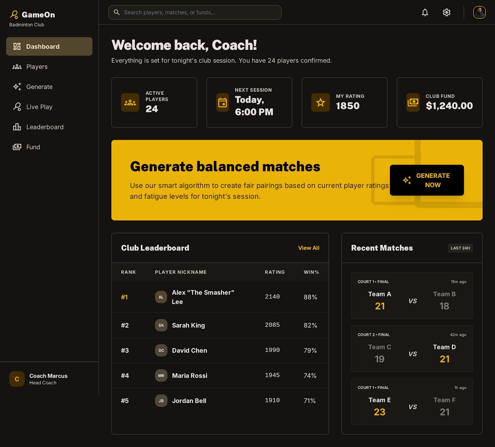
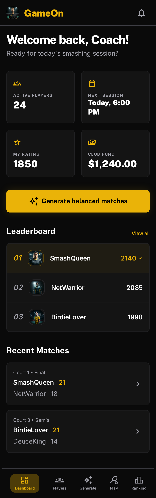

# GameOn — design shortlist (web + mobile)

Shortlisted directions for the GameOn badminton app, each generated in Stitch at
**desktop + mobile**. Pick one (or combine) to become the GameOn design system.

> Stitch project: "GameOn — Design Exploration". These PNGs are the durable copy
> (Stitch image URLs expire). The other directions were dropped.

| # | Theme | Tones | Font | Vibe |
|---|-------|-------|------|------|
| 02 | Forest & Lime | white · forest green · lime | Space Grotesk | active / healthy |
| 07 | Emerald Pro (dark) | graphite · emerald · white | Manrope | pro stats dashboard |
| 09 | Mustard Mono (dark) | near-black · gold · white | Bebas Neue | bold, broadcast |

---

## 02 · Forest & Lime  *(light · green + lime · Space Grotesk)*
Movement/health energy; lime reserved for the primary CTA. Light, fresh, friendly.
| Web | Mobile |
|---|---|
|  |  |

## 07 · Emerald Pro  *(dark · emerald on graphite · Manrope)*
Fintech-grade clarity; ratings/fund numbers pop on dark. Premium "pro stats" feel.
| Web | Mobile |
|---|---|
|  |  |

## 09 · Mustard Mono  *(dark · gold on near-black · Bebas Neue)*
Boldest, broadcast-graphic personality; condensed display headlines on black.
| Web | Mobile |
|---|---|
|  |  |
